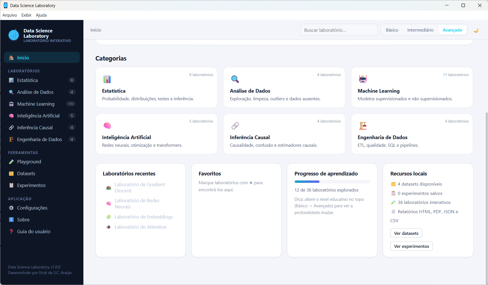

# 🧪 Data Science Laboratory

**Desenvolvido por: Erick de S.C. Araújo**

Aplicação desktop profissional para **aprender, simular, experimentar e compreender** Estatística, Ciência de Dados, Machine Learning, Inteligência Artificial, Inferência Causal e Engenharia de Dados — 100% local, offline-first e em Português do Brasil.

> Learn. Simulate. Experiment. Understand.



## O que é

O Data Science Laboratory é um **laboratório interativo** com **36 experimentos** que executam matemática real (sem resultados falsos ou "fake AI"):

- **Estatística** — probabilidade, distribuições, amostragem, testes de hipóteses, intervalos de confiança, poder, Monte Carlo e Teste A/B completo (frequentista + bayesiano, SRM, stopping, múltiplos testes)
- **Análise de Dados** — exploração, limpeza, outliers e dados ausentes
- **Machine Learning** — regressão linear/logística, KNN, K-Means, árvores, Random Forest, SVM, PCA, regularização, bias-variância e avaliação de modelos
- **Inteligência Artificial** — gradient descent, redes neurais, embeddings, attention e transformer
- **Inferência Causal** — correlação × causalidade, Simpson/confounding, propensity score e DiD
- **Engenharia de Dados** — ETL/ELT, qualidade de dados, motor SQL próprio e otimização de consultas

Cada laboratório segue o fluxo **Aprender → Configurar → Simular → Visualizar → Experimentar → Calcular → Explicar**, com o sistema **"Por quê?"** que explica didaticamente cada resultado (p-value, R², poder, MDE, lift, IC…), três níveis educativos e um **Data Science Playground** para combinar dataset → limpeza → modelo → avaliação em um pipeline.

## Recursos

| Recurso | Detalhe |
|---|---|
| Motor estatístico | Distribuições, testes, CI, poder, Monte Carlo e análise bayesiana implementados em TypeScript puro |
| Motor SQL | Parser + executor SQL local com planos de execução e custos (SCAN → FILTER → JOIN → GROUP BY → AGGREGATE) |
| Parquet | Leitor/escritor Parquet (PLAIN, sem compressão) para armazenamento colunar local |
| Datasets | Exemplos distribuídos em `resources/datasets` (clientes, vendas, flores, teste A/B) + gerador de dados sintéticos |
| Experimentos | Salvar, abrir, duplicar, comparar e exportar (HTML/PDF/JSON/CSV) |
| Offline-first | Nenhuma dependência de CDN, API externa ou fonte remota |
| Segurança | `contextIsolation`, `sandbox`, IPC validado, CSP, sem Node.js no renderer |

## Requisitos

- Windows 10/11 (builds de distribuição); o desenvolvimento roda em qualquer SO

## Guia de Instalação

Guia de instalação e uso dos executáveis compilados. Esta pasta contém o **instalador** e a **versão portátil** da aplicação desktop Data Science Laboratory — um laboratório interativo de Estatística, Ciência de Dados, Machine Learning, IA, Inferência Causal e Engenharia de Dados, 100% offline.

> Learn. Simulate. Experiment. Understand.

---

## 📦 Arquivos incluídos

| Arquivo | Tamanho | Tipo |
|---|---|---|
| `Data Science Laboratory-Setup-1.0.0.exe` | 91.4 MB | Instalador (NSIS) — instala o app no computador |
| `Data Science Laboratory-Portable-1.0.0.exe` | 91.1 MB | Portátil — executa sem instalar |

### Verificação (SHA-256)

Para confirmar que o arquivo não foi corrompido ou adulterado, compare o hash:

```powershell
Get-FileHash "Data Science Laboratory-Setup-1.0.0.exe" -Algorithm SHA256
Get-FileHash "Data Science Laboratory-Portable-1.0.0.exe" -Algorithm SHA256
```

```
c7c999dac9d7944c7c1b13935d041806b819d7b9e8edd9f091d974bbc5c36e62  Data Science Laboratory-Setup-1.0.0.exe
b6c93d2d422db0a40a6ed6d507a5dfd9e8491f2d86dcba5aff7baacf4d484946  Data Science Laboratory-Portable-1.0.0.exe
```

---

## 🖥️ Requisitos

- **Sistema:** Windows 10 ou Windows 11 (64 bits)
- **Disco:** ~400 MB livres (instalação)
- **Memória:** 4 GB recomendados (2 GB mínimo)
- **Rede:** não é necessária — a aplicação funciona 100% offline

---

## 🚀 Como instalar (versão Setup)

1. Dê dois cliques em `Data Science Laboratory-Setup-1.0.0.exe`.
2. Se o **SmartScreen** do Windows exibir um aviso, clique em **Mais informações → Executar assim mesmo** (o executável não é assinado digitalmente; veja a nota abaixo).
3. Escolha o idioma do instalador e o diretório de instalação (padrão: `%LOCALAPPDATA%\Programs\Data Science Laboratory`).
4. O instalador cria atalhos no **Menu Iniciar** e na **Área de Trabalho**.
5. Abra o **Data Science Laboratory** pelo atalho.

**Desinstalar:** Painel de Controle → Programas e Recursos → Data Science Laboratory → Desinstalar.

---

## 💾 Como usar (versão Portátil)

A versão portátil **não instala nada** — basta executar:

1. Copie `Data Science Laboratory-Portable-1.0.0.exe` para onde quiser (pendrive, pasta local…).
2. Dê dois cliques para abrir. O app inicia imediatamente.

> **Nota:** dados de sessão (experimentos salvos, preferências e logs) ficam em `%APPDATA%\Data Science Laboratory`, mesmo na versão portátil. Para levar tudo junto, leve também essa pasta ou use a opção **Exportar** de cada experimento.

---

## 📁 Onde ficam os dados

| Dado | Local |
|---|---|
| Configurações e experimentos | `%APPDATA%\Data Science Laboratory` |
| Logs de execução | `%APPDATA%\Data Science Laboratory\logs\app.log` |
| Datasets e recursos do app | dentro da pasta de instalação (`resources\resources`) |

---

## ⚠️ Nota sobre o SmartScreen

Os executáveis **não são assinados digitalmente** (não possuem certificado de código). Por isso o Windows pode exibir o aviso *"Windows protegeu seu computador"* na primeira execução. Isso é esperado para builds locais — clique em **Mais informações → Executar assim mesmo**. Para eliminar o aviso, é necessário assinar os executáveis com um certificado de código (EV ou OV).

---

## 🔧 Solução de problemas

| Problema | Solução |
|---|---|
| Aviso do SmartScreen | Mais informações → Executar assim mesmo (ver nota acima) |
| Dataset não carrega em um laboratório | Verifique o log em `%APPDATA%\Data Science Laboratory\logs\app.log`; os datasets de exemplo estão em `resources\resources\datasets` dentro da instalação |
| App não abre | Confirme o Windows 10/11 64 bits e execute o arquivo como administrador uma vez |
| Dúvidas sobre um experimento | Cada laboratório tem o botão **"Por quê?"** com explicação didática de cada resultado |

---

## 🧪 O que vem dentro

- **36 experimentos** em 6 áreas: Estatística, Análise de Dados, Machine Learning, Inteligência Artificial, Inferência Causal e Engenharia de Dados
- Motores implementados do zero em TypeScript: estatística, SQL, Parquet, Monte Carlo, Redes Neurais/Transformers
- Datasets de exemplo incluídos + gerador de dados sintéticos
- Exportação de experimentos (HTML/PDF/JSON/CSV)
- **Data Science Playground** — pipeline completo: dataset → limpeza → modelo → avaliação

Consulte `docs/USER_GUIDE.md` no repositório para o guia completo.

---

## 📜 Licença

© 2026 Erick de S.C. Araújo · MIT.

---

*Gerado em 03/09/2026 · Para reconstruir os executáveis a partir do código: `npm run dist`*
